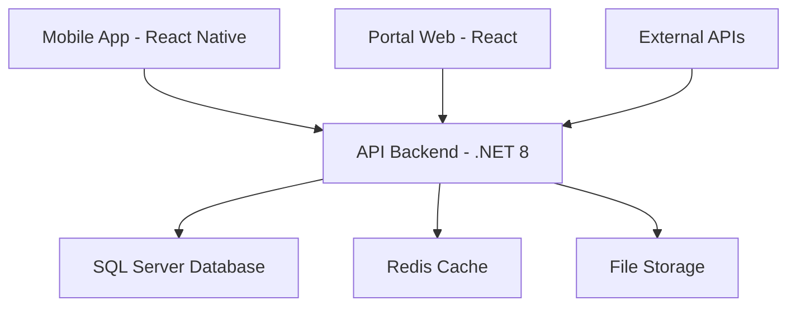
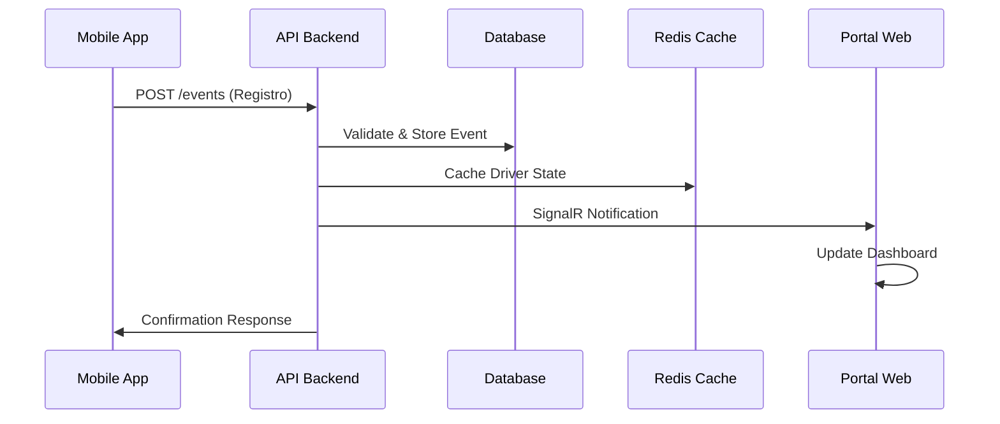

# 📋 DOCUMENTAÇÃO TÉCNICA COMPLETA
## Portal Administrativo - Diário de Bordo Digital

**Versão**: 1.0  
**Data**: 17 de setembro de 2025  
**Autor**: Gabriel Campos  

---

## 📖 ÍNDICE

1. [Visão Geral do Sistema](#1-visão-geral-do-sistema)
2. [Regras de Negócio](#2-regras-de-negócio)
3. [Arquitetura do Portal Web](#3-arquitetura-do-portal-web)
4. [Arquitetura da API Backend](#4-arquitetura-da-api-backend)
5. [Arquitetura do Mobile App](#5-arquitetura-do-mobile-app)
6. [Integrações e Comunicação](#6-integrações-e-comunicação)
7. [Segurança e Compliance](#7-segurança-e-compliance)
8. [Performance e Escalabilidade](#8-performance-e-escalabilidade)
9. [Deployment e DevOps](#9-deployment-e-devops)
10. [Próximos Passos](#10-próximos-passos)

---

## 1. VISÃO GERAL DO SISTEMA

### 1.1 Propósito
Sistema digital para controle de jornada de trabalho de motoristas profissionais, substituindo o diário de bordo físico com soluções tecnológicas que garantem compliance com a legislação trabalhista brasileira (CLT) e regulamentações do setor de transporte.

### 1.2 Stakeholders
- **Motoristas**: Registro digital de jornada via app mobile
- **Gestores de Frota**: Monitoramento em tempo real
- **RH**: Relatórios trabalhistas e compliance
- **Administradores**: Configuração do sistema
- **Auditores**: Relatórios para fiscalização

### 1.3 Componentes do Sistema


---

## 2. REGRAS DE NEGÓCIO

### 2.1 Gestão de Jornada de Trabalho

#### 2.1.1 Estados do Motorista
```typescript
enum DriverState {
  OFF_SHIFT = 'OFF_SHIFT',      // Fora do turno
  WORKING = 'WORKING',          // Trabalhando
  MEAL = 'MEAL',               // Refeição
  REST = 'REST',               // Descanso
  DISPOSAL = 'DISPOSAL',       // Disposição
  INSPECTION = 'INSPECTION'    // Inspeção
}
```

#### 2.1.2 Tipos de Eventos
```typescript
enum EventType {
  // Controle de turno
  SHIFT_START = 'SHIFT_START',
  SHIFT_END = 'SHIFT_END',
  
  // Pausas obrigatórias
  MEAL_START = 'MEAL_START',
  MEAL_END = 'MEAL_END',
  REST_START = 'REST_START',
  REST_END = 'REST_END',
  
  // Atividades específicas
  DISPOSAL_START = 'DISPOSAL_START',
  DISPOSAL_END = 'DISPOSAL_END',
  INSPECTION_START = 'INSPECTION_START',
  INSPECTION_END = 'INSPECTION_END',
  
  // Eventos especiais
  EMERGENCY_STOP = 'EMERGENCY_STOP',
  VEHICLE_BREAKDOWN = 'VEHICLE_BREAKDOWN'
}
```

### 2.2 Validações de Negócio

#### 2.2.1 Máquina de Estados
```
OFF_SHIFT → SHIFT_START → WORKING
WORKING → MEAL_START → MEAL → MEAL_END → WORKING
WORKING → REST_START → REST → REST_END → WORKING
WORKING → DISPOSAL_START → DISPOSAL → DISPOSAL_END → WORKING
WORKING → INSPECTION_START → INSPECTION → INSPECTION_END → WORKING
ANY_STATE → SHIFT_END → OFF_SHIFT
```

#### 2.2.2 Regras Temporais (CLT)
- **Jornada máxima**: 8 horas diárias, 44 horas semanais
- **Intervalo obrigatório**: 1-2 horas para jornadas > 6 horas
- **Descanso mínimo**: 11 horas entre jornadas
- **Limite semanal**: Máximo 2 horas extras por dia
- **Registro temporal**: Margem de ±10 minutos para eventos

#### 2.2.3 Validações Geográficas
- **Raio de trabalho**: Eventos só podem ser registrados dentro do raio de 5km da base
- **Geolocalização obrigatória**: Todos os eventos devem ter coordenadas GPS
- **Detecção de movimento**: Impedir registros durante deslocamento (velocidade > 5km/h)

### 2.3 Hierarquia Organizacional

#### 2.3.1 Estrutura de Empresa
```typescript
interface Company {
  id: string
  name: string
  cnpj: string
  settings: {
    workdayStartTime: string      // "06:00"
    workdayEndTime: string        // "18:00"
    maxDailyHours: number         // 8
    maxWeeklyHours: number        // 44
    mandatoryBreakMinutes: number // 60
    baseLocation: GeoPoint
    workRadius: number            // 5000 metros
  }
}
```

#### 2.3.2 Permissões por Perfil
```typescript
enum UserRole {
  SUPER_ADMIN = 'SUPER_ADMIN',
  COMPANY_ADMIN = 'COMPANY_ADMIN',
  FLEET_MANAGER = 'FLEET_MANAGER',
  HR_OPERATOR = 'HR_OPERATOR',
  SUPERVISOR = 'SUPERVISOR'
}

// Matriz de Permissões
const PERMISSIONS = {
  SUPER_ADMIN: ['*'], // Todos os acessos
  COMPANY_ADMIN: [
    'drivers.*', 'vehicles.*', 'reports.*', 
    'users.read', 'users.create', 'settings.*'
  ],
  FLEET_MANAGER: [
    'drivers.read', 'drivers.update', 'vehicles.*', 
    'reports.view', 'events.read'
  ],
  HR_OPERATOR: [
    'drivers.read', 'reports.export', 'workdays.read'
  ],
  SUPERVISOR: [
    'drivers.read', 'events.read', 'reports.view'
  ]
}
```

### 2.4 Sincronização Offline

#### 2.4.1 Estratégia de Conflitos
1. **Idempotência**: Eventos duplicados são ignorados (baseado em clientId)
2. **Clock Skew**: Ajuste automático de timestamp baseado em diferença detectada
3. **Conflict Resolution**: 
   - Server sempre vence para dados críticos
   - Last-write-wins para dados não críticos
   - Manual resolution para conflitos complexos

#### 2.4.2 Regras de Sincronização
- **Batch Size**: Máximo 50 eventos por sincronização
- **Retry Logic**: Exponential backoff (1s, 2s, 4s, 8s, 16s)
- **Data Validation**: Validação completa no servidor
- **Rollback**: Capacidade de reverter sincronizações com erro

---

## 3. ARQUITETURA DO PORTAL WEB

### 3.1 Stack Tecnológico
- **Framework**: React 18.3 + TypeScript 5.5
- **Build Tool**: Vite 7.1
- **UI Library**: shadcn/ui + Tailwind CSS
- **Estado**: Context API + useState/useReducer
- **Roteamento**: React Router DOM 6
- **Formulários**: React Hook Form + Zod (planejado)
- **HTTP Client**: Axios (planejado)
- **Charts**: Recharts (planejado)

### 3.2 Arquitetura de Componentes

#### 3.2.1 Estrutura de Pastas
```
src/
├── components/
│   ├── ui/                 # shadcn/ui base components
│   ├── custom/             # Componentes de negócio
│   └── layouts/            # Layouts da aplicação
├── pages/                  # Páginas/rotas principais
├── contexts/               # Context providers (auth, theme)
├── hooks/                  # Custom hooks
├── services/               # API clients e integrações
├── types/                  # Definições TypeScript
├── utils/                  # Funções utilitárias
└── lib/                    # Configurações e setup
```

#### 3.2.2 Padrões Implementados

**Context Pattern** para estado global:
```typescript
// auth-context.tsx
interface AuthContextType {
  user: User | null
  isAuthenticated: boolean
  login: (email: string, password: string) => Promise<boolean>
  logout: () => void
}

// theme-context.tsx  
interface ThemeContextType {
  theme: 'light' | 'dark' | 'system'
  setTheme: (theme: Theme) => void
  effectiveTheme: 'light' | 'dark'
}
```

**Compound Components** para flexibilidade:
```typescript
// MetricCard.tsx - Componente reutilizável
interface MetricCardProps {
  title: string
  value: string | number
  change?: number
  icon: LucideIcon
  loading?: boolean
}
```

### 3.3 Features Implementadas

#### 3.3.1 Sistema de Autenticação
- Login com validação client-side
- Persistência de sessão (localStorage)
- Rotas protegidas com HOC
- Logout automático em caso de token expirado

#### 3.3.2 Dark Mode Completo
- 3 modos: Light, Dark, System
- CSS Variables para temas
- Persistência de preferências
- Transições suaves entre temas

#### 3.3.3 Dashboard Administrativo
- KPIs em tempo real
- Cards de métricas com indicadores
- Feed de atividade recente
- Gráficos de tendências (planejado)

#### 3.3.4 Gestão de Motoristas
- Lista paginada com filtros
- CRUD completo (Create, Read, Update, Disable)
- Formulários modais com Sheet component
- Busca por nome, CPF, status
- Actions menu para cada registro

### 3.4 Responsividade e UX

#### 3.4.1 Breakpoints
```css
/* Tailwind CSS breakpoints */
sm: 640px   /* Tablet portrait */
md: 768px   /* Tablet landscape */
lg: 1024px  /* Desktop small */
xl: 1280px  /* Desktop large */
2xl: 1536px /* Desktop XL */
```

#### 3.4.2 Layout Adaptativo
- **Desktop**: Sidebar fixa + content área
- **Tablet**: Sidebar colapsível
- **Mobile**: Menu hamburger + bottom navigation (planejado)

---

## 4. ARQUITETURA DA API BACKEND

### 4.1 Stack Tecnológico
- **Framework**: .NET 8 + ASP.NET Core
- **ORM**: Entity Framework Core 8
- **Database**: SQL Server 2022
- **Cache**: Redis 7
- **Authentication**: JWT + ASP.NET Identity
- **Validation**: FluentValidation
- **Mapping**: AutoMapper
- **Logging**: Serilog
- **Testing**: xUnit + Moq

### 4.2 Arquitetura Hexagonal (Clean Architecture)

#### 4.2.1 Camadas da Aplicação
```
┌─────────────────────────────────────────┐
│           API Layer (Controllers)       │
├─────────────────────────────────────────┤
│       Application Layer (Services)      │
├─────────────────────────────────────────┤
│         Domain Layer (Entities)         │
├─────────────────────────────────────────┤
│     Infrastructure Layer (Data)         │
└─────────────────────────────────────────┘
```

#### 4.2.2 Domain Layer - Entidades Principais

**Event Entity** (Agregado Principal):
```csharp
public class Event
{
    public Guid Id { get; private set; }
    public Guid DriverId { get; private set; }
    public Guid CompanyId { get; private set; }
    public Guid? VehicleId { get; private set; }
    public EventType Type { get; private set; }
    public DateTime StartedAt { get; private set; }
    public DateTime? EndedAt { get; private set; }
    public GeoLocation? Location { get; private set; }
    public AuditInfo AuditInfo { get; private set; }
    
    // Domain methods
    public Result EndEvent(DateTime endTime, GeoLocation? location)
    public Result ValidateTransition(DriverState currentState)
    public TimeSpan CalculateDuration()
}
```

**Driver Entity**:
```csharp
public class Driver
{
    public Guid Id { get; private set; }
    public Guid CompanyId { get; private set; }
    public string Name { get; private set; }
    public CPF Cpf { get; private set; } // Value Object
    public Phone Phone { get; private set; } // Value Object
    public Email Email { get; private set; } // Value Object
    public DriverStatus Status { get; private set; }
    public DriverState CurrentState { get; private set; }
    
    // Domain methods
    public Result ChangeState(EventType eventType)
    public bool CanRegisterEvent(EventType type)
    public WorkdaySummary CalculateWorkday(DateTime date)
}
```

#### 4.2.3 Application Layer - Use Cases

**CQRS Pattern** com MediatR:
```csharp
// Commands
public record CreateEventCommand(
    Guid DriverId,
    EventType Type, 
    DateTime StartedAt,
    GeoLocation? Location
) : IRequest<Result<Guid>>;

// Queries  
public record GetDriverEventsQuery(
    Guid DriverId,
    DateTime From,
    DateTime To
) : IRequest<Result<List<EventDto>>>;

// Handlers
public class CreateEventHandler : IRequestHandler<CreateEventCommand, Result<Guid>>
{
    public async Task<Result<Guid>> Handle(CreateEventCommand request, CancellationToken cancellationToken)
    {
        // 1. Validate business rules
        // 2. Create domain entity
        // 3. Persist changes
        // 4. Publish domain events
    }
}
```

### 4.3 Funcionalidades Principais

#### 4.3.1 Event Management
- **Create Event**: Registro de novos eventos com validação
- **End Event**: Finalização de eventos em andamento
- **Event History**: Consulta histórica por período
- **Bulk Sync**: Sincronização offline em lote

#### 4.3.2 Workday Calculation
```csharp
public class WorkdayCalculator
{
    public WorkdaySummary Calculate(List<Event> events)
    {
        var workingTime = CalculateWorkingHours(events);
        var breaks = CalculateBreaks(events);
        var overtime = CalculateOvertime(workingTime);
        var anomalies = DetectAnomalies(events);
        
        return new WorkdaySummary(
            Date: events.First().StartedAt.Date,
            TotalHours: workingTime,
            BreakTime: breaks,
            OvertimeHours: overtime,
            Anomalies: anomalies
        );
    }
}
```

#### 4.3.3 Real-time Features
- **SignalR Hubs**: Notificações em tempo real
- **Event Streaming**: Atualizações de status do motorista
- **Alerts**: Violações de jornada e anomalias

### 4.4 APIs RESTful

#### 4.4.1 Event Endpoints
```
POST   /api/v1/events                    # Criar evento
PATCH  /api/v1/events/{id}/end          # Finalizar evento
GET    /api/v1/events/{id}              # Buscar evento
GET    /api/v1/drivers/{id}/events      # Eventos do motorista
POST   /api/v1/events/sync              # Sincronização offline
```

#### 4.4.2 Driver Endpoints
```
GET    /api/v1/drivers                  # Listar motoristas
POST   /api/v1/drivers                  # Criar motorista
GET    /api/v1/drivers/{id}             # Buscar motorista
PUT    /api/v1/drivers/{id}             # Atualizar motorista
DELETE /api/v1/drivers/{id}             # Desativar motorista
GET    /api/v1/drivers/{id}/workdays    # Relatórios de jornada
```

#### 4.4.3 Company & Admin Endpoints
```
GET    /api/v1/companies/{id}/dashboard # Dashboard da empresa
GET    /api/v1/reports/workdays         # Relatórios trabalhistas
POST   /api/v1/reports/export           # Exportar relatórios
GET    /api/v1/users                    # Gerenciar usuários
POST   /api/v1/auth/login               # Autenticação
```

---

## 5. ARQUITETURA DO MOBILE APP

### 5.1 Stack Tecnológico (Planejado)
- **Framework**: React Native 0.72
- **Navigation**: React Navigation 6
- **Estado**: Redux Toolkit + RTK Query
- **Forms**: React Hook Form + Zod
- **Storage**: AsyncStorage + SQLite
- **Maps**: React Native Maps
- **Permissions**: React Native Permissions
- **Background**: React Native Background Job

### 5.2 Funcionalidades Core

#### 5.2.1 Registro de Eventos
- Interface simples com botões grandes
- Confirmação por biometria (futuro)
- Captura automática de geolocalização
- Modo offline com sincronização automática

#### 5.2.2 Monitoramento de Jornada
- Timer em tempo real da jornada atual
- Alertas de pausas obrigatórias
- Histórico diário de eventos
- Status visual do motorista

#### 5.2.3 Sincronização Inteligente
- Background sync quando conectado
- Conflict resolution automático
- Retry com exponential backoff
- Indicadores de status de sincronização

### 5.3 Offline-First Architecture

#### 5.3.1 Local Storage
```typescript
// SQLite schema
CREATE TABLE events (
  id TEXT PRIMARY KEY,
  client_id TEXT UNIQUE,
  driver_id TEXT,
  type TEXT,
  started_at TEXT,
  ended_at TEXT,
  location TEXT,
  synced BOOLEAN DEFAULT 0,
  created_at TEXT
);

CREATE TABLE sync_queue (
  id INTEGER PRIMARY KEY,
  event_id TEXT,
  operation TEXT, -- 'CREATE', 'UPDATE', 'DELETE'
  retry_count INTEGER DEFAULT 0,
  last_attempt TEXT
);
```

#### 5.3.2 Sync Strategy
1. **Immediate Sync**: Tentar sincronizar imediatamente
2. **Queue**: Se falhar, adicionar à fila de sincronização
3. **Background Sync**: Executar periodicamente
4. **Conflict Resolution**: Resolver conflitos no servidor

---

## 6. INTEGRAÇÕES E COMUNICAÇÃO

### 6.1 Fluxo de Dados



### 6.2 Event-Driven Architecture

#### 6.2.1 Domain Events
```csharp
public abstract record DomainEvent(Guid Id, DateTime OccurredAt);

public record EventCreatedDomainEvent(
    Guid Id, 
    DateTime OccurredAt,
    Guid EventId,
    Guid DriverId, 
    EventType Type
) : DomainEvent(Id, OccurredAt);

public record WorkdayCompletedDomainEvent(
    Guid Id,
    DateTime OccurredAt, 
    Guid DriverId,
    WorkdaySummary Summary
) : DomainEvent(Id, OccurredAt);
```

#### 6.2.2 Event Handlers
```csharp
public class EventCreatedHandler : IDomainEventHandler<EventCreatedDomainEvent>
{
    public async Task Handle(EventCreatedDomainEvent @event)
    {
        // 1. Update driver current state in cache
        // 2. Send real-time notification to portal
        // 3. Check for anomalies and send alerts
        // 4. Update dashboard metrics
    }
}
```

### 6.3 Caching Strategy

#### 6.3.1 Redis Cache Patterns
```csharp
// Driver current state (high frequency reads)
await _cache.SetStringAsync($"driver:{driverId}:state", state, TimeSpan.FromMinutes(60));

// Daily events (medium frequency)  
await _cache.SetStringAsync($"driver:{driverId}:events:{date:yyyy-MM-dd}", events, TimeSpan.FromMinutes(15));

// Dashboard metrics (low frequency)
await _cache.SetStringAsync($"company:{companyId}:dashboard", metrics, TimeSpan.FromMinutes(5));
```

#### 6.3.2 Cache Invalidation
- **Write-through**: Atualizar cache ao modificar dados
- **Time-based**: TTL apropriado por tipo de dado
- **Event-based**: Invalidar cache em domain events

---

## 7. SEGURANÇA E COMPLIANCE

### 7.1 Autenticação e Autorização

#### 7.1.1 JWT Implementation
```csharp
public class JwtService
{
    public string GenerateToken(User user)
    {
        var claims = new[]
        {
            new Claim(ClaimTypes.NameIdentifier, user.Id.ToString()),
            new Claim(ClaimTypes.Email, user.Email),
            new Claim("role", user.Role.ToString()),
            new Claim("companyId", user.CompanyId.ToString()),
            new Claim("permissions", string.Join(",", user.GetPermissions()))
        };
        
        var token = new JwtSecurityToken(
            issuer: _config["Jwt:Issuer"],
            audience: _config["Jwt:Audience"], 
            claims: claims,
            expires: DateTime.UtcNow.AddHours(8),
            signingCredentials: new SigningCredentials(key, SecurityAlgorithms.HmacSha256)
        );
        
        return new JwtSecurityTokenHandler().WriteToken(token);
    }
}
```

#### 7.1.2 Permission-Based Authorization
```csharp
[Authorize]
[RequirePermission("drivers.create")]
public async Task<IActionResult> CreateDriver(CreateDriverRequest request)
{
    // Implementation
}

// Custom authorization attribute
public class RequirePermissionAttribute : AuthorizeAttribute, IAuthorizationRequirement
{
    public string Permission { get; }
    
    public RequirePermissionAttribute(string permission)
    {
        Permission = permission;
        Policy = permission;
    }
}
```

### 7.2 Data Protection

#### 7.2.1 LGPD Compliance
- **Data Encryption**: AES-256 para dados sensíveis em repouso
- **PII Protection**: Mascaramento de CPF, telefone em logs
- **Right to Deletion**: Soft delete com anonimização
- **Data Portability**: APIs para exportação de dados pessoais

#### 7.2.2 Audit Trail
```csharp
public class AuditLog
{
    public Guid Id { get; set; }
    public string UserId { get; set; }
    public string Action { get; set; }       // CREATE, UPDATE, DELETE, READ
    public string EntityType { get; set; }   // Driver, Event, etc
    public string EntityId { get; set; }
    public string Changes { get; set; }      // JSON with old/new values
    public DateTime Timestamp { get; set; }
    public string IPAddress { get; set; }
    public string UserAgent { get; set; }
}
```

### 7.3 API Security

#### 7.3.1 Rate Limiting
```csharp
// Configuração por endpoint
services.AddRateLimiter(options =>
{
    options.AddFixedWindowLimiter("EventCreation", policy =>
    {
        policy.PermitLimit = 10;           // 10 eventos
        policy.Window = TimeSpan.FromMinutes(1); // por minuto
    });
    
    options.AddSlidingWindowLimiter("GeneralAPI", policy =>
    {
        policy.PermitLimit = 100;          // 100 requests
        policy.Window = TimeSpan.FromMinutes(1); // por minuto
    });
});
```

#### 7.3.2 Input Validation
```csharp
public class CreateEventRequestValidator : AbstractValidator<CreateEventRequest>
{
    public CreateEventRequestValidator()
    {
        RuleFor(x => x.Type)
            .IsInEnum()
            .WithMessage("Invalid event type");
            
        RuleFor(x => x.StartedAt)
            .Must(BeRecentTimestamp)
            .WithMessage("Timestamp must be within 24 hours")
            .Must(NotBeFuture)
            .WithMessage("Cannot register future events");
            
        When(x => x.Location != null, () => {
            RuleFor(x => x.Location.Latitude)
                .InclusiveBetween(-90, 90);
            RuleFor(x => x.Location.Longitude)
                .InclusiveBetween(-180, 180);
        });
    }
}
```

---

## 8. PERFORMANCE E ESCALABILIDADE

### 8.1 Database Optimization

#### 8.1.1 Indexing Strategy
```sql
-- Queries mais frequentes
CREATE NONCLUSTERED INDEX IX_Events_DriverId_Date 
ON Events (DriverId, StartedAt) 
INCLUDE (Type, EndedAt, Location);

CREATE NONCLUSTERED INDEX IX_Events_CompanyId_Date
ON Events (CompanyId, StartedAt)
INCLUDE (DriverId, Type);

-- Partitioning por data
ALTER PARTITION FUNCTION EventDatePartition()
SPLIT RANGE ('2025-01-01');
```

#### 8.1.2 Query Optimization
```csharp
// Efficient pagination
public async Task<PagedResult<EventDto>> GetEventsAsync(
    Guid companyId, 
    int page, 
    int pageSize)
{
    var query = _context.Events
        .Where(e => e.CompanyId == companyId)
        .OrderByDescending(e => e.StartedAt)
        .AsNoTracking(); // Read-only queries
        
    var total = await query.CountAsync();
    var items = await query
        .Skip((page - 1) * pageSize)
        .Take(pageSize)
        .ProjectTo<EventDto>(_mapper.ConfigurationProvider) // Projection
        .ToListAsync();
        
    return new PagedResult<EventDto>(items, total, page, pageSize);
}
```

### 8.2 Caching Layers

#### 8.2.1 Multi-Level Cache
```
┌─────────────────┐    ┌─────────────────┐    ┌─────────────────┐
│   Browser       │───▶│   CDN/Proxy     │───▶│   Application   │
│   (HTTP Cache)  │    │   (Static)      │    │   (Redis)       │
└─────────────────┘    └─────────────────┘    └─────────────────┘
                                                       │
                                               ┌─────────────────┐
                                               │   Database      │
                                               │   (SQL Server)  │
                                               └─────────────────┘
```

#### 8.2.2 Cache Warming Strategy
```csharp
public class CacheWarmupService : IHostedService
{
    public async Task StartAsync(CancellationToken cancellationToken)
    {
        // Pre-load frequently accessed data
        await WarmDashboardMetrics();
        await WarmActiveDriverStates();
        await WarmCompanySettings();
    }
    
    private async Task WarmDashboardMetrics()
    {
        var companies = await _companyRepository.GetActiveCompaniesAsync();
        var tasks = companies.Select(async company =>
        {
            var metrics = await _metricsService.GetDashboardMetricsAsync(company.Id);
            await _cache.SetAsync($"dashboard:{company.Id}", metrics, TimeSpan.FromMinutes(5));
        });
        
        await Task.WhenAll(tasks);
    }
}
```

### 8.3 Horizontal Scaling

#### 8.3.1 Microservices Preparation
```
┌─────────────────┐    ┌─────────────────┐    ┌─────────────────┐
│   Gateway       │───▶│   Auth Service  │    │   File Service  │
│   (API Gateway) │    │   (Users/JWT)   │    │   (Reports)     │
└─────────────────┘    └─────────────────┘    └─────────────────┘
         │                       │                       │
         ▼                       ▼                       ▼
┌─────────────────┐    ┌─────────────────┐    ┌─────────────────┐
│   Event Service │    │  Driver Service │    │ Analytics Svc   │
│   (Core Logic)  │    │   (CRUD)        │    │  (Reporting)    │
└─────────────────┘    └─────────────────┘    └─────────────────┘
```

#### 8.3.2 Load Balancing Configuration
```yaml
# nginx.conf
upstream api_backend {
    least_conn;
    server api1.internal:5000 max_fails=3 fail_timeout=30s;
    server api2.internal:5000 max_fails=3 fail_timeout=30s;
    server api3.internal:5000 max_fails=3 fail_timeout=30s;
}

server {
    listen 80;
    
    location /api/ {
        proxy_pass http://api_backend;
        proxy_set_header X-Real-IP $remote_addr;
        proxy_set_header X-Forwarded-For $proxy_add_x_forwarded_for;
        
        # Health check
        proxy_next_upstream error timeout http_500 http_502 http_503;
    }
}
```

---

## 9. DEPLOYMENT E DEVOPS

### 9.1 Containerização

#### 9.1.1 Docker Configuration
```dockerfile
# API Dockerfile
FROM mcr.microsoft.com/dotnet/aspnet:8.0 AS base
WORKDIR /app
EXPOSE 80
EXPOSE 443

FROM mcr.microsoft.com/dotnet/sdk:8.0 AS build
WORKDIR /src
COPY ["API/API.csproj", "API/"]
COPY ["Application/Application.csproj", "Application/"]
COPY ["Domain/Domain.csproj", "Domain/"]
COPY ["Infrastructure/Infrastructure.csproj", "Infrastructure/"]
RUN dotnet restore "API/API.csproj"

COPY . .
WORKDIR "/src/API"
RUN dotnet build "API.csproj" -c Release -o /app/build

FROM build AS publish
RUN dotnet publish "API.csproj" -c Release -o /app/publish

FROM base AS final
WORKDIR /app
COPY --from=publish /app/publish .
ENTRYPOINT ["dotnet", "API.dll"]
```

#### 9.1.2 Docker Compose (Development)
```yaml
version: '3.8'

services:
  api:
    build: ./backend
    ports:
      - "5000:80"
    environment:
      - ASPNETCORE_ENVIRONMENT=Development
      - ConnectionStrings__DefaultConnection=Server=db;Database=DiarioBordo;User Id=sa;Password=YourPassword123;TrustServerCertificate=true;
      - Redis__ConnectionString=redis:6379
    depends_on:
      - db
      - redis
    
  web:
    build: ./portal-web
    ports:
      - "3000:80"
    environment:
      - REACT_APP_API_URL=http://localhost:5000/api
      
  db:
    image: mcr.microsoft.com/mssql/server:2022-latest
    environment:
      - ACCEPT_EULA=Y
      - SA_PASSWORD=YourPassword123
    ports:
      - "1433:1433"
    volumes:
      - sqldata:/var/opt/mssql
      
  redis:
    image: redis:7-alpine
    ports:
      - "6379:6379"
    volumes:
      - redisdata:/data

volumes:
  sqldata:
  redisdata:
```

### 9.2 CI/CD Pipeline

#### 9.2.1 GitHub Actions Workflow
```yaml
name: Deploy to Production

on:
  push:
    branches: [ main ]

jobs:
  test:
    runs-on: ubuntu-latest
    steps:
    - uses: actions/checkout@v3
    
    - name: Setup .NET
      uses: actions/setup-dotnet@v3
      with:
        dotnet-version: '8.0.x'
        
    - name: Run Tests
      run: |
        dotnet test --configuration Release --logger trx --results-directory "TestResults"
        
    - name: Publish Test Results
      uses: dorny/test-reporter@v1
      if: always()
      with:
        name: .NET Tests
        path: TestResults/*.trx
        reporter: dotnet-trx
        
  build-and-deploy:
    needs: test
    runs-on: ubuntu-latest
    steps:
    - uses: actions/checkout@v3
    
    - name: Build Docker Images
      run: |
        docker build -t ${{ secrets.REGISTRY }}/diario-bordo-api ./backend
        docker build -t ${{ secrets.REGISTRY }}/diario-bordo-web ./portal-web
        
    - name: Push to Registry
      run: |
        echo ${{ secrets.REGISTRY_PASSWORD }} | docker login ${{ secrets.REGISTRY }} -u ${{ secrets.REGISTRY_USERNAME }} --password-stdin
        docker push ${{ secrets.REGISTRY }}/diario-bordo-api
        docker push ${{ secrets.REGISTRY }}/diario-bordo-web
        
    - name: Deploy to Production
      uses: appleboy/ssh-action@v0.1.5
      with:
        host: ${{ secrets.PROD_SERVER }}
        username: ${{ secrets.PROD_USERNAME }}
        key: ${{ secrets.PROD_SSH_KEY }}
        script: |
          cd /opt/diario-bordo
          docker-compose pull
          docker-compose up -d --remove-orphans
          docker system prune -f
```

### 9.3 Monitoring e Observabilidade

#### 9.3.1 Application Insights
```csharp
// Startup.cs
services.AddApplicationInsightsTelemetry();

// Custom metrics
public class MetricsService
{
    private readonly TelemetryClient _telemetryClient;
    
    public void TrackEventCreation(string driverId, string eventType)
    {
        _telemetryClient.TrackEvent("EventCreated", new Dictionary<string, string>
        {
            ["DriverId"] = driverId,
            ["EventType"] = eventType,
            ["CompanyId"] = GetCompanyId()
        });
    }
    
    public void TrackApiResponseTime(string endpoint, double responseTime)
    {
        _telemetryClient.TrackMetric($"API.ResponseTime.{endpoint}", responseTime);
    }
}
```

#### 9.3.2 Health Checks
```csharp
services.AddHealthChecks()
    .AddSqlServer(connectionString, name: "database")
    .AddRedis(redisConnectionString, name: "cache")
    .AddCheck<EventServiceHealthCheck>("event-service")
    .AddApplicationInsightsPublisher();

// Custom health check
public class EventServiceHealthCheck : IHealthCheck
{
    public async Task<HealthCheckResult> CheckHealthAsync(HealthCheckContext context, CancellationToken cancellationToken = default)
    {
        try
        {
            // Test critical functionality
            var canCreateEvent = await _eventService.ValidateSystemAsync();
            
            return canCreateEvent 
                ? HealthCheckResult.Healthy("Event service is responsive")
                : HealthCheckResult.Unhealthy("Event service validation failed");
        }
        catch (Exception ex)
        {
            return HealthCheckResult.Unhealthy("Event service threw exception", ex);
        }
    }
}
```

---

## 10. PRÓXIMOS PASSOS

### 10.1 Roadmap de Desenvolvimento

#### 10.1.1 Fase 1: MVP (Q4 2025)
- ✅ **Portal Web**: Login, Dashboard, CRUD Motoristas
- ✅ **Dark Mode**: Sistema completo de temas
- 🔄 **API Backend**: Autenticação, CRUD básico
- 📱 **Mobile App**: Registro de eventos básicos
- 🗄️ **Database**: Schema inicial + migrações

#### 10.1.2 Fase 2: Core Features (Q1 2026)
- 📊 **Relatórios**: Jornadas, horas extras, compliance
- 🔄 **Sincronização**: Offline-first mobile
- 🚨 **Alertas**: Violações de jornada em tempo real
- 📍 **Geolocalização**: Validação de raio de trabalho
- 👥 **Gestão de Usuários**: RBAC completo

#### 10.1.3 Fase 3: Advanced Features (Q2 2026)
- 📈 **Analytics**: Dashboard executivo
- 📱 **Notificações Push**: Alertas mobile
- 🔐 **Biometria**: Autenticação por digital
- 🚛 **Gestão de Veículos**: CRUD completo
- 📄 **Exportações**: PDF, Excel, compliance reports

#### 10.1.4 Fase 4: Scale & Integration (Q3 2026)
- 🔌 **API Gateway**: Rate limiting, versioning
- 🔗 **Integrações**: ERP, folha de pagamento
- 🌐 **Multi-tenancy**: Suporte a múltiplas empresas
- 📊 **Business Intelligence**: Power BI integration
- 🏭 **Microservices**: Decomposição da monolith

### 10.2 Considerações Técnicas

#### 10.2.1 Débitos Técnicos
- **Testes**: Cobertura unitária e integração
- **Documentação API**: OpenAPI/Swagger completo
- **Performance**: Load testing e otimizações
- **Security**: Penetration testing e audit
- **Accessibility**: WCAG 2.1 compliance no portal

#### 10.2.2 Infraestrutura
- **Kubernetes**: Orquestração de containers
- **Azure**: Cloud hosting e services
- **CDN**: Distribuição de assets estáticos
- **Backup**: Estratégia de backup e recovery
- **Monitoring**: APM e logging centralizado

### 10.3 Riscos e Mitigações

#### 10.3.1 Riscos Técnicos
- **Escalabilidade**: Load testing contínuo
- **Segurança**: Security reviews regulares
- **Performance**: Monitoring e alertas
- **Disponibilidade**: SLA de 99.9% uptime

#### 10.3.2 Riscos de Negócio
- **Compliance**: Atualização conforme mudanças na CLT
- **Adoção**: Treinamento e suporte aos usuários
- **Competição**: Diferenciação técnica e UX
- **Regulamentação**: Adaptação a novas leis

---

## 📋 CONCLUSÃO

Este documento apresenta a arquitetura completa do sistema **Diário de Bordo Digital**, cobrindo desde as regras de negócio fundamentais até os detalhes técnicos de implementação. A solução foi projetada para ser:

- **Escalável**: Arquitetura que suporta crescimento
- **Segura**: Compliance com LGPD e boas práticas
- **Resiliente**: Offline-first e recuperação de falhas
- **Moderna**: Stack tecnológico atual e padrões da indústria
- **Maintível**: Clean architecture e testes automatizados

O **Portal Web** já implementado serve como base sólida para o desenvolvimento das demais funcionalidades, demonstrando a viabilidade técnica e a qualidade da arquitetura proposta.

---

**Documento vivo** - Versão 1.0 - Atualizado em 17/09/2025